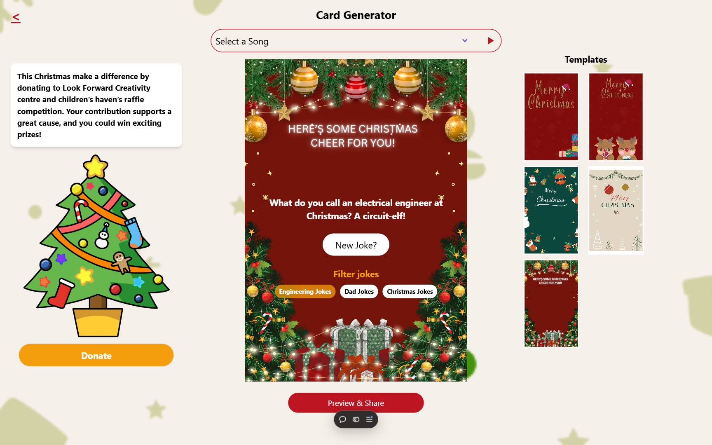

# Xmas Cards App

A fun and interactive Christmas card generator built with React! This project was a collaborative effort to spread holiday cheer and promote a meaningful cause.

## Table of contents

- [Overview](#overview)
  - [Features](#features)
  - [Screenshot](#screenshot)
  - [Links](#links)
- [My process](#my-process)
  - [Built with](#built-with)
  - [What I learned](#what-i-learned)
  - [Continued development](#continued-development)
  - [Useful resources](#useful-resources)
- [Author](#author)

## Overview

### Features

Users can:

- Browse and choose from a variety of Christmas card templates
- Generate random jokes with a filter for engineering or festive humor
- Personalize cards and pair them with Christmas jingles
- Download and share customized cards with friends and family
- Explore and support the **Look Forward Creativity Center and Children’s Home** through the app

### Screenshot

#### Card template selection page



#### Shared Card Page


#### Final card preview
.png)

### Links
- Live App: [Xmas Cards](https://xmas-cards.vercel.app/shared)

## My process

### Built with

- Semantic HTML5 markup
- [React](https://reactjs.org/) - JS library
- [React Redux](https://redux.js.org/) - For state management
- [React Router](https://reactrouter.com/) - For navigation
- [CSS Modules](https://github.com/css-modules/css-modules) - For scoped and maintainable styles

### What I learned

This project was a fantastic opportunity to refine my front-end skills and implement fun, engaging features. Here are some highlights:

1. **I implemented a saving feature**
   Using html2Canvas I was able to implement the saving of the card to a png for users to share.
   ```js
	const handleDownloadPNG = () => {
  		const cardElement = document.getElementById("card-preview");
  		html2canvas(cardElement).then((canvas) => {
    			canvas.toBlob((blob) => {
      				saveAs(blob, "xmas-card.png");
    			});
  		});
	};
   ```


2. **State Management with Redux:**
   Redux was used to manage the global state, ensuring that users' preferences, such as joke filters and selected card templates, persisted seamlessly across the app.

3. **I implemented sharing links and using useLocation to pass state**
   Used useLocation to pass state from page to page and i found that rather intersting usecase for my app. also used useParams to generate the sharedcard link.
   ```js
   // 4. Generate a shareable link with query parameters
	const generateShareableLink = () => {

		const strippedBackground = cardData?.background.replace(/^url\(|\)$/g, "");
		const backgroundInUse = backgrounds.find(b => strippedBackground === b.value);

		const queryParams = new URLSearchParams({
			jokeId: cardData?.joke?.id,
			backgroundId: backgroundInUse.id,
			songId: cardData?.song?.id,
			savedName: name
		}).toString();

		return `${window.location.origin}/shared?${queryParams}`;
	};
   ```

4. **Promoting a Cause:**
   The app was designed to not only spread cheer but also draw attention to the **Look Forward Creativity Center and Children’s Home**, demonstrating how tech can support impactful causes.

5. **Made a vercel.json:**
  Initially, routing to the sharedCard page wasn’t working when users shared their link with others. This resulted in a 404 error on Vercel. After researching the issue, I discovered that Vercel requires explicit configuration to handle dynamic routing in single-page applications. To fix this, I created a vercel.json file and configured it to serve the index.html file for all routes. This ensured that Vercel correctly handled the routing, enabling the sharedCard page to load as expected when a shared link was accessed.

### Continued development

In future updates, I aim to:

- Add more templates and customization options, such as text styling and background themes
- Integrate an API for a wider range of jokes and jingles
- Implement a backend for storing user-generated cards
- Optimize app performance with image preloading and lazy loading

### Useful resources

- [React Redux Docs](https://redux.js.org/) - Helped streamline global state management.
- [React Router Docs]() - This resource was instrumental in understanding routing and link generation.

## Author

- Twitter - [@KolaDev01](https://twitter.com/KolaDev01)
- LinkedIn - [ChristopherKola](https://reactrouter.com/en/main.)

---
